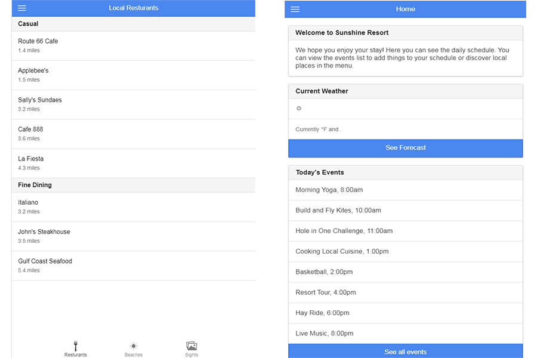

# Ionic Framework Demo App

This is a demo app built with the Ionic Framework that you can preview in the browser or clone and run locally on an emulator or device.

## Run locally

This assumes you already have an emulator setup for iOS or Android. Substitute `ios` for `android` below to use Android.

    npm install -g ionic cordova
    git clone https://github.com/Big-Silver/Ionic-Resort-App.git
    cd Ionic-Resort-App
    ionic platform add ios
    ionic emulate ios

## LICENSE

Ionic is licensed under the MIT Open Source license. For more information, see the LICENSE file in this repository.
